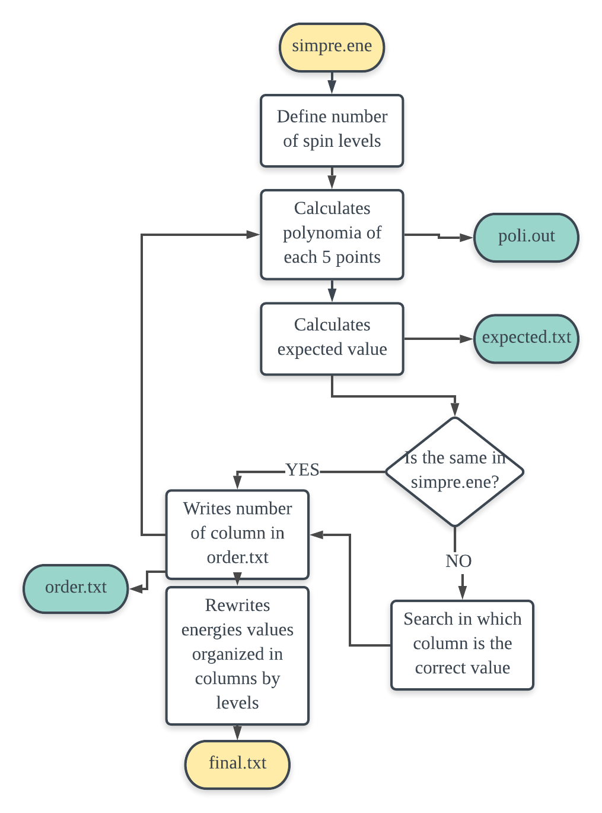
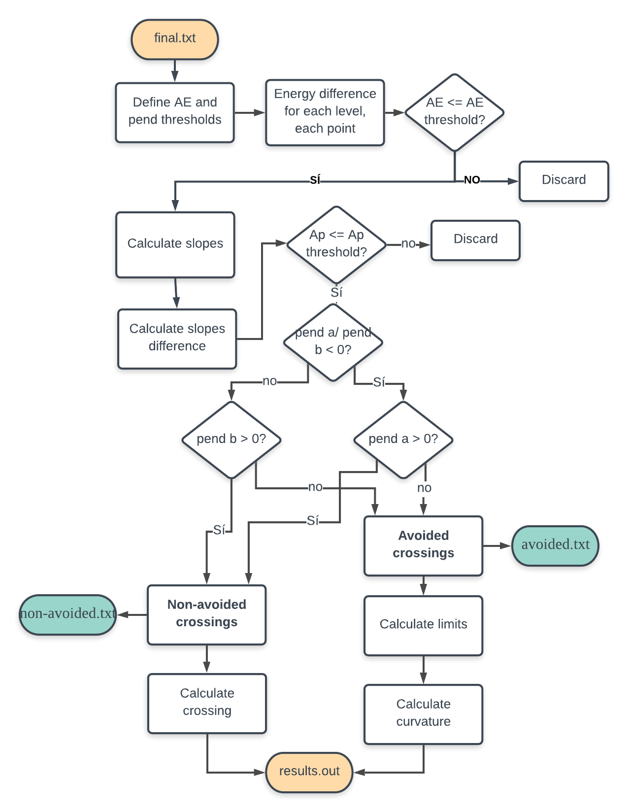

# Clock transitions classifier code

Welcome to the repo hosting **Clock transiftions classifier**. Here you will find a short description of the code and algorithm implemented; very-easy (non-computational scientists don't be afraid!) instructions to run the code; and how to visualize/analyze your results. 

The motivation of this project comes from the idea of studing the robustness of Clock transitions and the magneto-structural properties governing this phenomena. For that we performed systematic studies by changing relevant parameters related to the magneto-structural properties of different molecular systems that can behave as molecular spin qubits. 

* We pourposed the development of a numerical method to solve complex cases from which is impossible to abtain analytical solutions of the depence of the paramenters governening the clock transitions. 

* Implement the method in a computational tool, user-friendly, open-source.

* Rationalize the design of new molecules with better structural properties to enhance the robustness of the clock transitions. 


## Requierements
- python 2.7

### Python modules to be imported:
- Os
- Math
- Numpy
- Matplotlib 
- Pandas


## Code

You have two options to run this code. If your study has used SIMPRE, you will need to run the post-analysis script related ```organizer.py``` in order to sort the energy of your spin levels in columns. 

To analyze the evolution of spin levels, or whatever you are studing as a function of a variable run ```transitions-classifier.py```.


## Instructions

### Results obtained from SIMPRE:

1. Fisrts plot your results:
``` python plotter.py  ```

2. 


## About the program...
Simplified workflows of the main two scripts:





# FAQ 
Silvia M. Gimenez Santamarina

silvia.m.gimenez@uv.es
