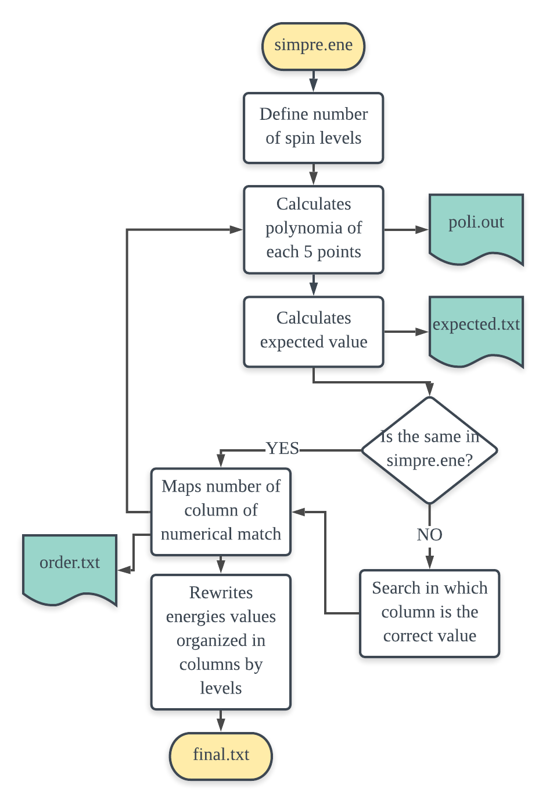
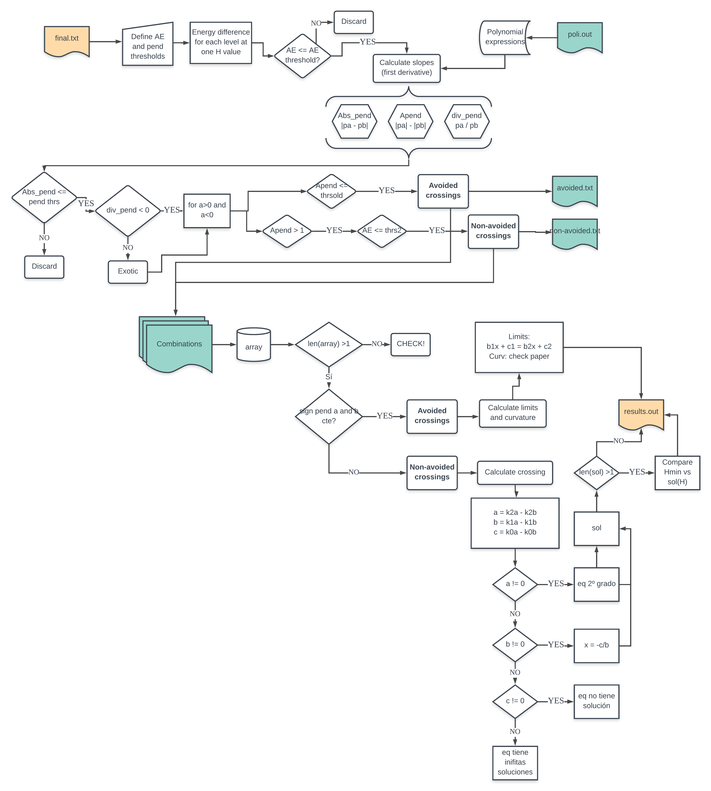

# Clock transitions classifier code

Welcome to the repo hosting **Clock transitions classifier**. Here you will find a short description of the code and algorithm implemented; very-easy (non-computational scientists don't be afraid!) instructions to run the code; and how to visualize/analyze your results. 

The motivation of this project comes from the idea of studying the robustness of Clock transitions and the magneto-structural properties governing this phenomenon. For that, we performed systematic studies by changing relevant parameters related to the magneto-structural properties of different molecular systems that can behave as molecular spin qubits. 

* We purposed the development of a numerical method to solve complex cases from which is impossible to obtain analytical solutions of the dependence of the parameters governing the clock transitions. 

* Implement the method in a computational tool, user-friendly, open-source.

* Rationalize the design of new molecules with better structural properties to enhance the robustness of the clock transitions. 

## Related Article

This work has been published as a scientific article in Chemical Science. You can check it now under the following DOI:
DOI: 10.1039/D0SC01187H

## Requierements
- python 2.7

### Python modules to be imported:
- Os
- Math
- Numpy
- Matplotlib 
- Pandas


## Code

You have two options to run this code. If your study has used SIMPRE, you will need to run the post-analysis script related ```organizer.py``` to sort the energy of your spin levels in columns. 

To analyze the evolution of spin levels, or whatever you are studying as a function of a variable run ```transitions-classifier.py```.


## Instructions

### Starting from **SIMPRE**'s output:

Run the following commands at the same directory where the file *simpre.ene* and *simpre.out* are.

(Optional) Plot your **SIMPRE**'s results. Running the following command will open an interactive plot with the data contained in *simpre.ene*: 

``` python plotter.py  ```

1. Set the parameters defining your system at *parameters.py*. To modify the file you can, open the file with a typical plain text editor (Linux: Gedit; Windows: Notepad; MacOS: TextEditor) or use vim if you work on the command line. Then run:

``` python parameters.py ```

2. Run the script that classifies correctly sorts the energy value corresponding to each spin level. This step ends creating a new directory called *res*, where you will find all the intermediate files created along the performance of the code and your final results. Also, you will find a second directory called *plots*, where very intuitive quality control can be done by checking the graph *summary_plots.png* created at the current step. 

``` python organizer.py  ```

3. Finally, it's time to classify the crosses and avoided crosses of your spin levels. The results will be stored in */res/* directory, *results.out*, *avoided_sum.txt* and *nonavoided_sum.txt* are created. In case you want to analyze the results more in detail, we generate files with the detailed information of both levels crossing accessible by the user at */combinations/* directory. For more info read **Output files** section. Run:

``` python transitions_classifier.py  ```


## About the program...
Simplified workflows of the main two scripts:





# FAQ 
Silvia M. Gimenez Santamarina

silvia.m.gimenez@uv.es
